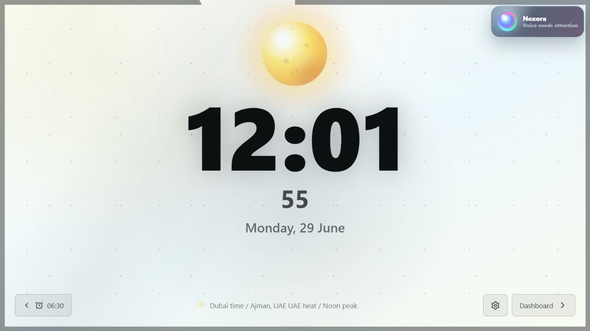
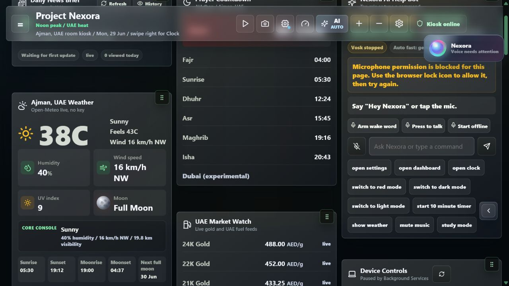
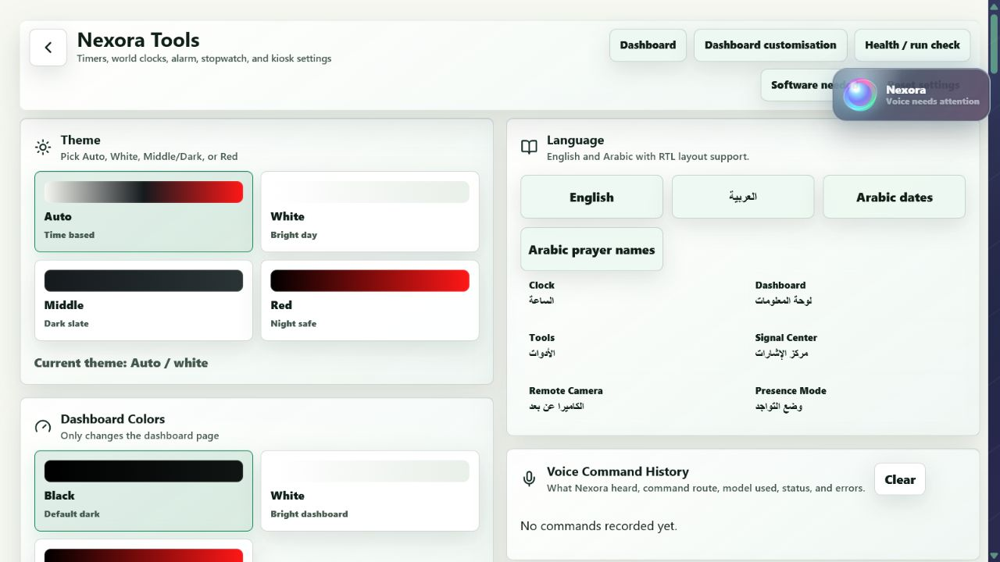
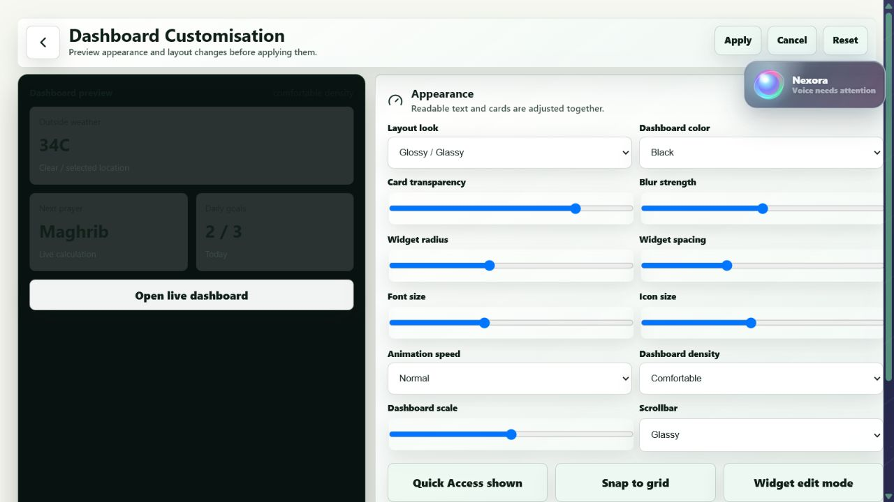
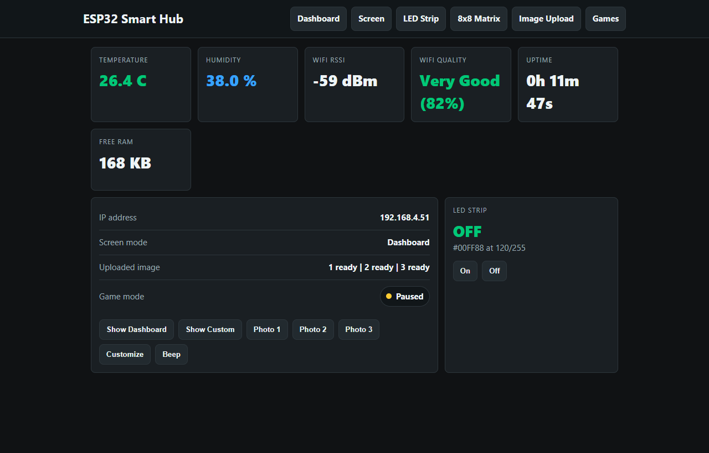
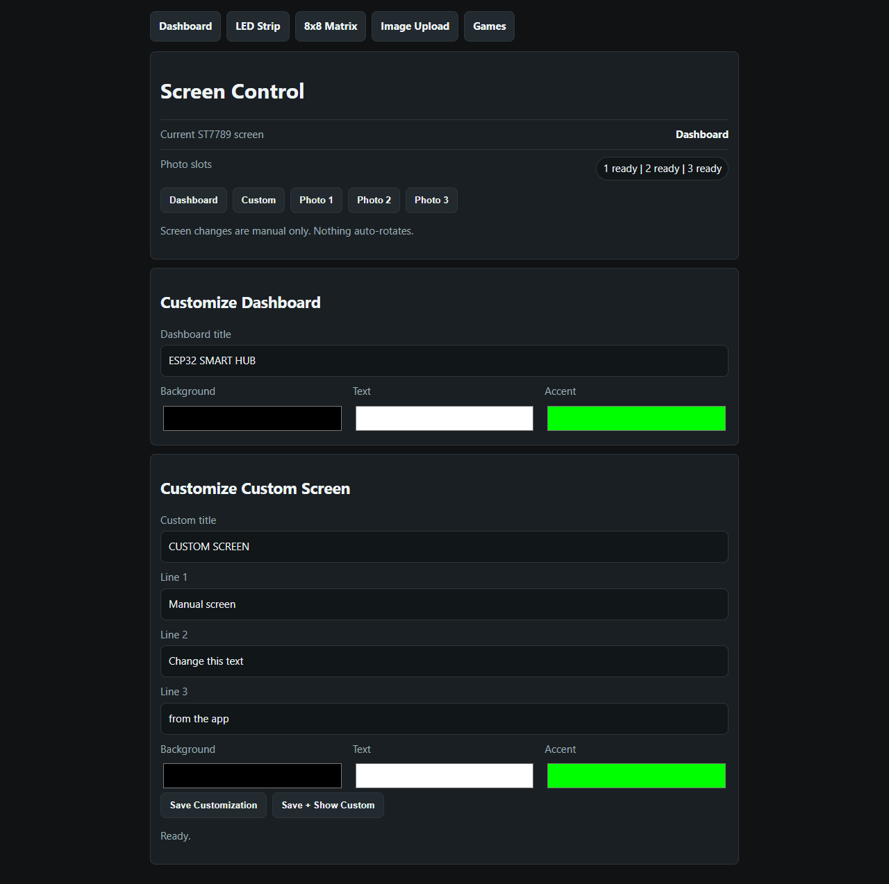
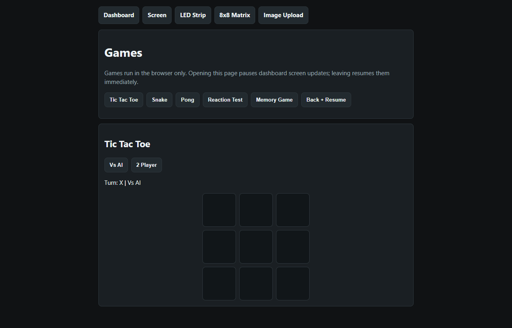

# Bedroom Dashboard

Bedroom Dashboard is a local smart bedroom kiosk/dashboard with a clock screen, widgets, tools, device controls, ESP32 support, and a fully local AI assistant.

## Photos















## Dashboard And ESP32 Status

The dashboard side is a React/Vite bedroom kiosk with clock, tools, dashboard widgets, music, weather, prayer times, local camera features, signal pages, device controls, and a local Ollama AI assistant. The AI runs locally, but it is still under active work and has bugs that need to be fixed.

The ESP32 side is an efficient smart hub for the room. It has its own web dashboard, ST7789 screen control, DHT22 temperature/humidity readings, Wi-Fi signal quality, LED strip controls, 8x8 matrix control, image/photo upload slots, and browser games. The ESP32 is also still being improved; there is one small game/dashboard focus bug being polished.

See the full ESP32 hardware, wiring, power, and upload notes here:

```text
docs/ESP32_SMART_HUB.md
```

## Important Setup Notes

- ESP32 code needs your Wi-Fi details updated before uploading it to the board.
- Recommended device spec: 8 GB RAM.
- No GPU is required.
- AI runs fully locally through Ollama.
- Use the all-in-one setup/download script so Ollama, local AI models, Python packages, Node packages, and the other required tools are installed together.

## Where To Start

The latest snapshot is:

```text
Bedroom Dashboard V 27.0 AI improvement/Bedroom Dashboard
```

Use the all-in-one launch/setup files inside that folder:

- Windows: `SETUP FILE.bat` or `START UP.py`
- Ubuntu/Linux: `SETUP FILE.sh` or `START UP.py`
- Installer scripts: `scripts/install/` and `scripts/setup/`

The all-in-one setup/download flow is the easiest path because it downloads Ollama/models and the other required software instead of making you install each piece by hand.

## Included Snapshots

This repository keeps multiple historical source snapshots:

- `Bedroom Dashboard Needs Review`
- `Bedroom Dashboard V 1.0`
- `Bedroom Dashboard V 2.0`
- `Bedroom Dashboard V 3.0`
- `Bedroom Dashboard V 4.0`
- `Bedroom Dashboard V 5.0`
- `Bedroom Dashboard V 6.0`
- `Bedroom Dashboard V 27.0 AI improvement`

## Not Committed

The original local folder included multi-gigabyte runtime/generated assets. These are intentionally excluded from GitHub:

- `node_modules`, Python virtual environments, build output, caches, and logs
- local `.env` files
- Ollama blobs and downloaded speech model binaries
- local music (you can upload your own by putting it in that file), custom media folders, camera/security snapshots, and dashboard backups

Recreate those files on the target machine by running the setup/download scripts.
